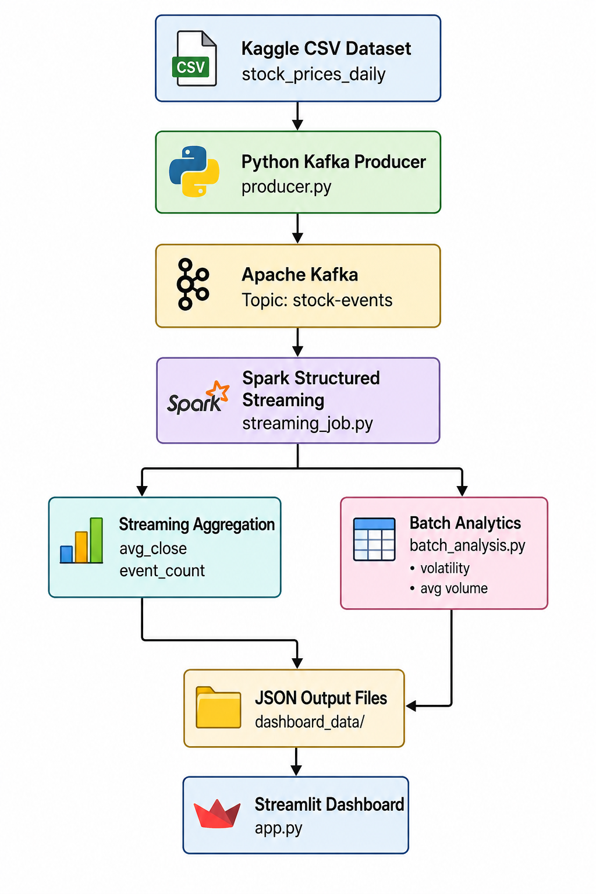
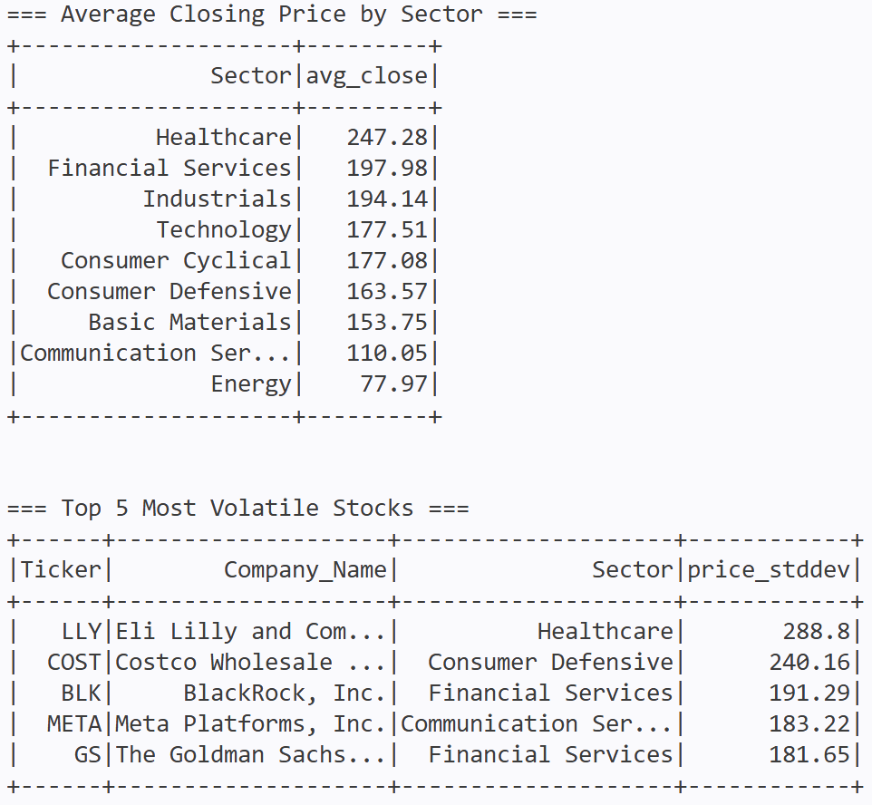
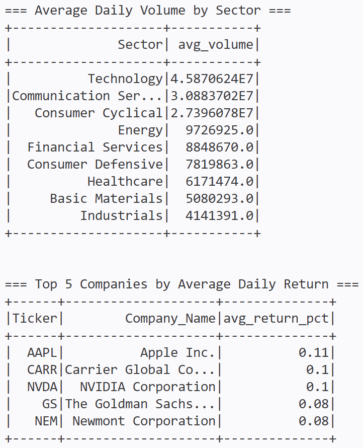

# BDP_ALP — US Stock Market Historical OHLCV Analytics Pipeline

## Big Data Processing Final Project

## Project Status

Current progress:

- [x] Public GitHub repository initialized
- [x] Final dataset selected
- [x] Dataset downloaded from Kaggle
- [x] Dataset size validated
- [x] Dataset schema validated
- [x] Normalized sample dataset generated
- [x] Docker Compose infrastructure setup
- [ ] HDFS data storage setup
- [x] Spark batch processing
- [x] Kafka producer simulation
- [x] Spark Structured Streaming
- [x] Streamlit dashboard
- [ ] Final findings and documentation

<!-- - [x] Public GitHub repository initialized
- [x] Final dataset selected
- [x] Dataset downloaded from Kaggle
- [x] Dataset size validated
- [x] Dataset schema validated
- [x] Normalized sample dataset generated
- [ ] Docker Compose infrastructure setup
- [ ] HDFS data storage setup
- [ ] Spark batch processing
- [ ] Kafka producer simulation
- [ ] Spark Structured Streaming
- [ ] Streamlit dashboard
- [ ] Final findings and documentation -->

---

## Final Dataset

This project uses the following final dataset:

**US Stock Market Historical OHLCV**  
Source: Kaggle  
Dataset file: `stock_prices_daily.csv`

### Dataset Validation Result

| Item | Result |
|---|---:|
| Raw CSV size | 33.03 MB |
| Minimum required dataset size | 10 MB |
| Size requirement status | Passed |
| Total records | 184,138 rows |
| Original number of columns | 11 |

### Original Dataset Columns

```text
date
ticker
company_name
sector
industry
open
high
low
close
adj_close
volume
```

The original Kaggle dataset uses the column `company_name`. For consistency with the project design, this column is normalized into `company` during preprocessing.

### Normalized Sample Data Columns

```text
date
ticker
company
sector
industry
open
high
low
close
adj_close
volume
daily_return_pct
price_range
```

Additional derived columns:

| Column | Description |
|---|---|
| `daily_return_pct` | Percentage change from open price to close price |
| `price_range` | Difference between daily high and daily low |

A normalized sample containing 1,000 rows is included in:

```text
data/sample/sample_stock_data.csv
```

The full raw dataset is not stored in GitHub. It can be downloaded using:

```bash
./scripts/download_dataset.sh
```

---

## Architecture Diagram



## Domain

Finance / Stock Market Analytics

## Project Description

This project builds an end-to-end big data pipeline for analyzing historical United States stock market data. Historical OHLCV records are processed through batch analytics, while the same records are replayed sequentially to simulate incoming stock market events for streaming analysis.

## Problem Statement

How can a big data pipeline analyze historical stock performance by company and sector while also monitoring simulated stock market activity in real time?

## Planned Batch Insights

1. Identify the sector with the highest average trading volume.
2. Identify companies with the highest average daily return.
3. Identify companies with the highest volatility based on daily return variation.

## Planned Real-Time Metrics

1. Number of stock events received through Kafka.
2. Latest close price per company during replay.
3. Top companies based on accumulated streaming volume.

## Planned Technology Stack

- Docker Compose
- Apache Hadoop HDFS
- Apache Kafka
- Apache Spark
- Spark Structured Streaming
- Streamlit
- Python

## Planned Pipeline Architecture

```text
Kaggle CSV Dataset
        |
        +----> HDFS Storage ----> Spark Batch Processing ----> Batch Output
        |
        +----> Python Producer ----> Kafka ----> Spark Structured Streaming
                                                     |
                                                     v
                                             Streamlit Dashboard
```

## Dataset Download

Install dependencies:

```bash
python3 -m venv .venv
source .venv/bin/activate
pip install kaggle pandas
```

Login to Kaggle:

```bash
kaggle auth login
```

Download the final dataset:

```bash
chmod +x scripts/download_dataset.sh
./scripts/download_dataset.sh
```

The downloaded raw CSV file will be stored locally in:

```text
data/raw/stock_prices_daily.csv
```

The raw CSV file is ignored by Git and is not uploaded to this public repository.

## How to Run
### 1. Clone the Repository
```bash
git clone https://github.com/CatherineElina/BDP_ALP.git
cd BDP_ALP
```
### 2. Start Docker Services
Run all services using Docker Compose:
```bash
docker compose up
```
### 3. Run Kafka Producer
Open a new terminal:
```bash
python producer/producer.py
```
Example producer output:

Sent: AAPL @ 192.45
Sent: MSFT @ 415.22
Sent: NVDA @ 120.31
The producer simulates live stock market events by replaying historical OHLCV records into the Kafka topic stock-events.
### 4. Run Spark Structured Streaming
Open another terminal:
```bash
docker exec -it bdp-alp-spark-master /opt/spark/bin/spark-submit --packages org.apache.spark:spark-sql-kafka-0-10_2.13:4.0.0 /opt/spark/jobs/streaming_job.py
```
Example Spark output:

Batch: 17
+--------------------+----------+---------+-----------+
|window              |sector    |avg_close|event_count|
+--------------------+----------+---------+-----------+
This streaming job consumes Kafka events and continuously aggregates stock market data by sector.
### 5. Run Batch Analysis
```bash
docker exec -it bdp-alp-spark-master /opt/spark/bin/spark-submit /opt/spark/jobs/batch_analysis.py
```
### 6. Open the Dashboards
Service	URL
Kafka UI:               http://localhost:8080
Spark Master UI:	http://localhost:8082
Streamlit Dashboard:	http://localhost:8501
The Streamlit dashboard will automatically update as streaming data is processed.

## Expected Output

### Spark Batch Analytics Output

The Spark batch analytics job prints historical stock market aggregation results directly to the console.

The output includes:
- Average trading volume by sector
- Top companies by average daily return
- Most volatile stocks



---

### Streamlit Dashboard

The Streamlit dashboard visualizes live stock market aggregation generated by Spark Structured Streaming.

The dashboard displays:
- Average closing price by sector
- Event count per streaming window
- Historical trend visualization


## Findings & Conclusion

### Batch Analytics Findings

The Spark batch analysis successfully processed 184,138 historical US stock market records and generated several important insights across sectors and companies.

The analysis showed that the Technology sector produced the highest average trading volume, reaching approximately 45.9 million shares, followed by Communication Services and Consumer Cyclical sectors. This indicates that technology-related companies consistently dominate trading activity in the historical dataset.

In terms of average closing price, the Healthcare sector recorded the highest average stock closing price at approximately 247.28, followed by Financial Services and Industrials. This suggests that companies within these sectors generally maintained higher stock price valuations during the observed historical period.

The volatility analysis identified several companies with highly fluctuating stock prices. Eli Lilly and Company (LLY) showed the highest price volatility, followed by Costco Wholesale (COST), BlackRock (BLK), Meta Platforms (META), and Goldman Sachs (GS). High volatility indicates stronger stock price fluctuations and potentially higher market risk.

The average daily return analysis showed that Apple (AAPL), Carrier Global Corporation (CARR), and NVIDIA (NVDA) achieved some of the strongest average positive daily returns among the analyzed companies. This suggests relatively stronger daily price growth compared to opening prices.

---

### Streaming Analytics Findings

The streaming pipeline successfully simulated real-time stock market activity by replaying historical OHLCV records through Apache Kafka.

Spark Structured Streaming continuously consumed Kafka events and aggregated stock market metrics by sector using micro-batch processing and sliding time windows.

The Streamlit dashboard successfully visualized:
- Average closing price by sector
- Event counts within streaming windows
- Historical sector trends
- Continuously updating live charts

During the simulation, the dashboard demonstrated that certain sectors repeatedly generated higher event frequency and higher average closing prices over time.

The integration between Kafka, Spark Structured Streaming, Docker Compose, and Streamlit successfully enabled near real-time analytics and live visualization.

---

### Conclusion

This project successfully implemented an end-to-end big data analytics pipeline using Apache Kafka, Apache Spark Structured Streaming, Docker Compose, and Streamlit.

The system supports both batch analytics and streaming analytics workflows while processing historical US stock market OHLCV data.

The project demonstrates how modern big data technologies can be integrated to ingest, process, aggregate, and visualize large-scale financial datasets in near real time within a containerized environment.

The final pipeline successfully achieved the main project objectives:
- Historical stock market batch analysis
- Real-time event streaming simulation
- Streaming aggregation using Spark Structured Streaming
- Interactive live dashboard visualization
- Reproducible deployment using Docker Compose

## Known Limitations

- The system uses historical CSV data replay instead of a live stock market API.
- The current implementation uses Docker-mounted local storage instead of a fully distributed Hadoop HDFS cluster.
- Streaming throughput and scalability were not benchmarked under high-load production conditions.
- The dashboard currently focuses on sector-level aggregation and does not include advanced forecasting or machine learning models.
- Fault tolerance and multi-node distributed deployment were not fully implemented.
- The Kafka producer replays historical records sequentially and does not simulate actual market timing or irregular trading activity.