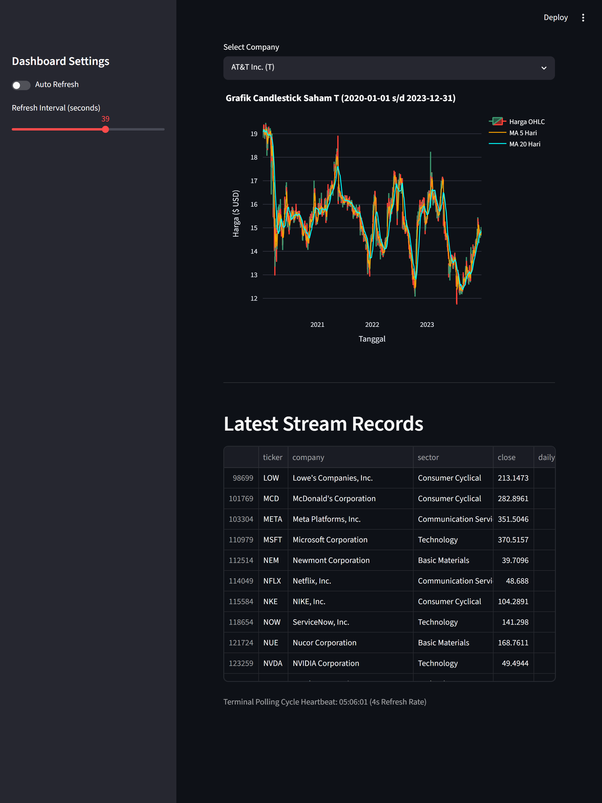

# BDP_ALP — US Stock Market Historical OHLCV Analytics Pipeline

## Big Data Processing Final Project

## Final Dataset

This project uses the following final dataset:

**US Stock Market Historical OHLCV**
Source: Kaggle
Dataset file: `stock_prices_daily.csv`

### Dataset Validation Result
The dataset was validated prior to processing.

Validation checks included:
- Missing value detection
- Duplicate record detection
- Data type verification
- Dataset size verification

No significant data quality issues were identified.

| Item                          |       Result |
| ----------------------------- | -----------: |
| Raw CSV size                  |     33.03 MB |
| Minimum required dataset size |        10 MB |
| Size requirement status       |       Passed |
| Total records                 | 184,138 rows |
| Number of columns             |           11 |

### Dataset Columns

```text
date
ticker
company_name
sector
industry
open
high
low
close
adj_close
volume
```

### Dataset Description

The dataset contains historical daily OHLCV (Open, High, Low, Close, Volume) stock market records from major publicly traded companies in the United States.

Several key fields are heavily used throughout the analytics pipeline:

| Column   | Description                                                 |
| -------- | ----------------------------------------------------------- |
| `ticker` | Unique stock symbol used to identify each company           |
| `sector` | Company business sector used for aggregation and comparison |
| `open`   | Stock opening price for a trading day                       |
| `close`  | Stock closing price for a trading day                       |
| `high`   | Highest trading price during the day                        |
| `low`    | Lowest trading price during the day                         |
| `volume` | Total traded shares during the day                          |


### How to Get the Data Inside

The full raw dataset is not stored in GitHub. It can be downloaded using:

```bash
./scripts/download_dataset.sh
```

---

## Architecture Diagram

```text
                           +----------------------+
                           | Kaggle CSV Dataset   |
                           | stock_prices_daily   |
                           +----------+-----------+
                                      |
                                      v
                        +---------------------------+
                        | Docker Volume / Local CSV |
                        +-------------+-------------+
                                      |
                                      v
                     +--------------------------------+
                     | Hadoop HDFS (NameNode/DataNode)|
                     | hdfs://namenode:9000/data/... |
                     +---------------+----------------+
                                     |
                    +----------------+----------------+
                    |                                 |
                    v                                 v

       +--------------------------+     +--------------------------+
       | Spark Batch Processing   |     | Kafka Producer Simulator |
       | batch_analysis.py        |     | producer.py              |
       +-------------+------------+     +-------------+------------+
                     |                                |
                     v                                v
          +---------------------+         +----------------------+
          | Batch Analytics     |         | Apache Kafka         |
          | Sector Aggregation  |         | stock-events topic   |
          +---------------------+         +-----------+----------+
                                                      |
                                                      v
                                   +----------------------------------+
                                   | Spark Structured Streaming       |
                                   | streaming_job.py                 |
                                   +----------------+-----------------+
                                                    |
                                                    v
                                   +----------------------------------+
                                   | Streamlit Dashboard              |
                                   | Real-Time Visualization          |
                                   +----------------------------------+
```

---

## Domain

Finance / Stock Market Analytics

## Project Description

This project builds an end-to-end big data pipeline for analyzing historical United States stock market data. Historical OHLCV records are processed through distributed batch analytics using Apache Spark and Hadoop HDFS, while the same records are replayed sequentially to simulate incoming stock market events for streaming analysis using Apache Kafka and Spark Structured Streaming.

The project demonstrates the integration of modern big data technologies for scalable data ingestion, distributed storage, batch processing, real-time streaming analytics, and interactive dashboard visualization.

## Problem Statement

How can a big data pipeline analyze historical stock performance by company and sector while also monitoring simulated stock market activity in real time?

## Project Objectives

1. Store large-scale stock market data using Hadoop HDFS.
2. Perform distributed historical analysis using Apache Spark.
3. Simulate real-time stock market activity using Apache Kafka.
4. Process streaming events using Spark Structured Streaming.
5. Visualize insights through an interactive Streamlit dashboard.

## Planned Batch Insights

1. Identify the sector with the highest average trading volume.
2. Identify companies with the highest average daily return.
3. Identify companies with the highest volatility based on daily return variation.

## Planned Real-Time Metrics

1. Market Pulse Matrix: Real-time calculation of global daily returns, historical volatility (Market Risk via Sample Standard Deviation), and Market Breadth (% of advancing vs. declining stocks).
2. Sector Performance & Capital Flow: Visual tracking of sector rotation to monitor where institutional capital ("whales") is flowing dynamically.
3. Anomaly & Volume Spike Detection: Instant identification of stocks experiencing trading volumes significantly higher than their historical average baseline:
   $$\text{Volume Spike Ratio} = \frac{V_{\text{today}}}{\bar{V}_{\text{hist}}}$$
4. Interactive Ticker Explorer: Deep-dive workbench visualizing anti-zoom Plotly Candlestick profiles integrated with 5-day and 20-day Moving Averages (MA) for trend discovery.

## Technology Stack

* Docker Compose
* Apache Hadoop HDFS
* Apache Kafka
* Apache Spark
* Spark Structured Streaming
* Streamlit
* Python

## Pipeline Architecture

```text
Kaggle CSV Dataset
        |
        v
Hadoop HDFS Storage
        |
        +----> Spark Batch Processing ----> Batch Analytics Output
        |
        +----> Python Kafka Producer ----> Apache Kafka
                                                 |
                                                 v
                                  Spark Structured Streaming
                                                 |
                                                 v
                                      Streamlit Dashboard
```

---

<!-- # Dataset Download

Install dependencies:

```bash
python3 -m venv .venv
source .venv/bin/activate
pip install kaggle pandas
```

Login to Kaggle:

```bash
kaggle auth login
```

Download the final dataset:

```bash
chmod +x scripts/download_dataset.sh
./scripts/download_dataset.sh
```

The downloaded raw CSV file will be stored locally in:

```text
data/raw/stock_prices_daily.csv
```

The raw CSV file is ignored by Git and is not uploaded to this public repository.

---

# How to Run

## 1. Clone the Repository

```bash
git clone https://github.com/CatherineElina/BDP_ALP.git
cd BDP_ALP
```

---

## 2. Start Docker Services

Run all services using Docker Compose:

```bash
docker compose up
```

This will start:

* Hadoop NameNode
* Hadoop DataNode
* Apache Kafka
* Spark Master
* Spark Worker
* Streamlit Dashboard

---

## 3. Upload Dataset to HDFS

### Create HDFS directory

```bash
docker exec -it bdp-alp-namenode hdfs dfs -mkdir -p /data/stock
```

### Copy dataset into NameNode container

```bash
docker cp data/stock_prices_daily.csv bdp-alp-namenode:/tmp/stock_prices_daily.csv
```

### Upload dataset from container into HDFS

```bash
docker exec -it bdp-alp-namenode hdfs dfs -put /tmp/stock_prices_daily.csv /data/stock/
```

### Verify dataset in HDFS

```bash
docker exec -it bdp-alp-namenode hdfs dfs -ls /data/stock/
```

Expected output:

```text
Found 1 items
-rw-r--r--   1 root supergroup ... /data/stock/stock_prices_daily.csv
```

---

## 4. Run Spark Batch Analysis

Open a new terminal:

```bash
docker exec -it bdp-alp-spark-master /opt/spark/bin/spark-submit /opt/spark/jobs/batch_analysis.py
```

The batch analysis job reads the dataset directly from Hadoop HDFS:

```python
hdfs://namenode:9000/data/stock/stock_prices_daily.csv
```

---

## 5. Run Kafka Producer

Open another terminal:

```bash
python producer/producer.py
```

Example producer output:

```text
Sent: AAPL @ 192.45
Sent: MSFT @ 415.22
Sent: NVDA @ 120.31
```

The producer simulates live stock market events by replaying historical OHLCV records into the Kafka topic `stock-events`.

---

## 6. Run Spark Structured Streaming

Open another terminal:

```bash
docker exec -it bdp-alp-spark-master /opt/spark/bin/spark-submit --packages org.apache.spark:spark-sql-kafka-0-10_2.13:4.0.0 /opt/spark/jobs/streaming_job.py
```

Example Spark output:

```text
[Batch 1] Successfully appended 752 engineered records to historical log
[Batch 2] Successfully appended 183 engineered records to historical log
[Batch 3] Successfully appended 564 engineered records to historical log
```

This streaming job consumes Kafka events and continuously aggregates stock market data by sector.

---

## 7. Open the Dashboards

| Service             | URL                   |
| ------------------- | --------------------- |
| Hadoop NameNode UI  | http://localhost:9870 |
| Kafka UI            | http://localhost:8080 |
| Spark Master UI     | http://localhost:8082 |
| Streamlit Dashboard | http://localhost:8501 |

The Streamlit dashboard will automatically update as streaming data is processed. -->

# How to Run

Silakan ikuti langkah-langkah di bawah ini secara berurutan untuk menjalankan seluruh pipeline dari awal.

## 1. Clone the Repository

```bash
git clone https://github.com/CatherineElina/BDP_ALP.git
cd BDP_ALP
```

---

## 2. Environment Setup & Dependency Installation

> ⚠️ **PENTING:** Karena setiap sistem memiliki path Python yang berbeda, **jangan gunakan folder `.venv` bawaan repository** jika ter-clone. Anda wajib membuat Virtual Environment baru di laptop sendiri untuk menghindari error interpreter path (*"executable not found"*).

### Langkah Setup Environment:

```bash
# 1. Hapus folder .venv lama jika ada (opsional)
# Windows (PowerShell): Remove-Item -Recurse -Force .venv
# Linux/Mac: rm -rf .venv

# 2. Buat virtual environment baru 
python3 -m venv .venv

# 3. Aktifkan virtual environment
# Di Windows (PowerShell):
.venv\Scripts\Activate.ps1
# Di Linux/Mac:
source .venv/bin/activate

# 4. Install seluruh dependencies proyek
pip install -r producer/requirements.txt
pip install kaggle pandas
```

---

## 3. Download Dataset

Sebelum menjalankan service, unduh dataset resmi terlebih dahulu:

1. Pastikan Anda sudah login atau memiliki kredensial Kaggle di laptop Anda:

```bash
kaggle auth login
```

2. Jalankan script unduhan:


**Bagi Pengguna Linux / Mac / Windows Git Bash:**
```bash
chmod +x scripts/download_dataset.sh
./scripts/download_dataset.sh
```

**Bagi Pengguna Windows (PowerShell):**

```bash
kaggle datasets download -d asadullahcreative/us-stock-market-historical-ohlcv-dataset -p data/raw --unzip
```

Dataset mentah berbentuk CSV akan tersimpan secara lokal di folder `data/raw/stock_prices_daily.csv`. File ini sudah otomatis diabaikan oleh `.gitignore` agar tidak mengotori repositori GitHub.

---

## 4. Start Docker Services

Sebelum menjalankan perintah di bawah ini, **pastikan aplikasi Docker Desktop sudah dibuka dan sedang berjalan (running)** di laptop Anda. Jika Docker Desktop belum aktif, perintah di bawah ini akan memicu error *"docker daemon is not running"*.

Setelah Docker Desktop dipastikan aktif, jalankan seluruh infrastruktur big data menggunakan Docker Compose:
```bash
docker compose up -d
```

>💡 Informasi: Parameter -d (detached mode) digunakan agar seluruh service berjalan di latar belakang (background), sehingga terminal ini tidak terkunci dan tetap bisa Anda gunakan untuk langkah berikutnya.

Perintah ini akan menyalakan service berikut di latar belakang:

* Hadoop NameNode & DataNode
* Apache Kafka
* Apache Spark Master & Worker
* Streamlit Dashboard

---

## 5. Upload Dataset to Hadoop HDFS

Salin dataset lokal yang baru diunduh ke dalam ekosistem penyimpanan terdistribusi HDFS:

### Create HDFS directory

```bash
docker exec -it bdp-alp-namenode hdfs dfs -mkdir -p /data/stock
```

### Copy dataset into NameNode container

```bash
docker cp data/raw/stock_prices_daily.csv bdp-alp-namenode:/tmp/stock_prices_daily.csv
```
### Upload dari container ke Hadoop HDFS

```bash
docker exec -it bdp-alp-namenode hdfs dfs -put /tmp/stock_prices_daily.csv /data/stock/
```

### Verify dataset in HDFS

```bash
docker exec -it bdp-alp-namenode hdfs dfs -ls /data/stock/
```

**Expected Output:**

```text
Found 1 items
-rw-r--r--   1 root supergroup ... /data/stock/stock_prices_daily.csv
```

---

## 6. Run Spark Batch Analysis

Buka terminal baru, **aktifkan virtual environment Anda terlebih dahulu**, lalu jalankan job analisis batch historis:

```bash
# Aktifkan .venv di terminal baru ini sebelum menjalankan command
# Windows (PowerShell): .venv\Scripts\Activate.ps1
# Linux/Mac: source .venv/bin/activate

# Jalankan Spark Batch Job
docker exec -it bdp-alp-spark-master /opt/spark/bin/spark-submit /opt/spark/jobs/batch_analysis.py
```

>💡 Informasi: Perintah docker exec di atas berjalan langsung di dalam isolated container, sehingga proses internal Docker tidak membutuhkan aktivasi .venv lokal Anda. Namun, pastikan virtual environment lokal Anda tetap aktif di terminal ini untuk menjaga konsistensi environment project Anda.

Job ini akan memproses data langsung dari HDFS (hdfs://namenode:9000/data/stock/stock_prices_daily.csv) dan mencetak metrik agregasi di konsol.

---

## 7. Run Kafka Producer (Stream Simulator)

Buka terminal baru lainnya untuk mulai mensimulasikan data pasar saham secara real-time. Anda wajib mengaktifkan virtual environment pada terminal baru ini karena script produsen berjalan langsung menggunakan Python interpreter lokal di laptop Anda:

```bash
# Wajib aktifkan .venv di terminal baru ini agar library 'kafka-python' / 'pandas' terdeteksi
# Windows (PowerShell): .venv\Scripts\Activate.ps1
# Linux/Mac: source .venv/bin/activate

# Jalankan Python Kafka Producer
python producer/producer.py
```

**Example Producer Output:**

```text
Sent: AAPL @ 192.45
Sent: MSFT @ 415.22
Sent: NVDA @ 120.31
```

Script ini membaca data historis dan mengirimkannya baris demi baris ke Kafka topic `stock-events`.

---

## 8. Run Spark Structured Streaming

Buka terminal baru satu lagi untuk memproses aliran data dari Kafka secara real-time:

```bash
# Aktifkan .venv di terminal baru ini (opsional/untuk konsistensi)
# Windows (PowerShell): .venv\Scripts\Activate.ps1
# Linux/Mac: source .venv/bin/activate

# Jalankan Spark Streaming Job
docker exec -it bdp-alp-spark-master /opt/spark/bin/spark-submit --packages org.apache.spark:spark-sql-kafka-0-10_2.13:4.0.0 /opt/spark/jobs/streaming_job.py
```

>⚠️ Catatan Penting: Sama seperti langkah Batch Analysis, perintah docker exec ini mengeksekusi Spark-Submit langsung di dalam Docker container master. Oleh karena itu, perintah ini tidak membutuhkan .venv lokal laptop Anda untuk bekerja, karena Spark akan menggunakan dependensi Java/Scala/Python yang sudah terisolasi di dalam kontainer Docker tersebut.

**Example Spark Output:**

```text
[Batch 1] Successfully appended 752 engineered records to historical log
[Batch 2] Successfully appended 183 engineered records to historical log
```

---

## 9. Open the Dashboards

Sekarang Anda dapat memantau jalannya pipeline dan visualisasi data melalui URL berikut:

| Service | URL |
| --- | --- |
| **Streamlit Dashboard** | http://localhost:8501 |
| Hadoop NameNode UI | http://localhost:9870 |
| Kafka UI | http://localhost:8080 |
| Spark Master UI | http://localhost:8082 |

Dashboard Streamlit akan melakukan *hot-reload* dan memperbarui grafiknya secara otomatis seiring data streaming diproses.


---

# Expected Output

## Spark Batch Analytics Output

The Spark batch analytics job processes historical stock market data stored inside Hadoop HDFS and prints aggregation results directly to the console.

The output includes:

* Average trading volume by sector
* Top companies by average daily return
* Most volatile stocks

```text
=== Average Closing Price by Sector ===
+--------------------+---------+
|              Sector|avg_close|
+--------------------+---------+
|          Healthcare|   247.28|
|  Financial Services|   197.98|
|         Industrials|   194.14|
|          Technology|   177.51|
|   Consumer Cyclical|   177.08|
|  Consumer Defensive|   163.57|
|     Basic Materials|   153.75|
|Communication Ser...|   110.05|
|              Energy|    77.97|
+--------------------+---------+


=== Top 5 Most Volatile Stocks ===
+------+--------------------+--------------------+------------+
|Ticker|        Company_Name|              Sector|price_stddev|
+------+--------------------+--------------------+------------+
|   LLY|Eli Lilly and Com...|          Healthcare|       288.8|
|  COST|Costco Wholesale ...|  Consumer Defensive|      240.16|
|   BLK|     BlackRock, Inc.|  Financial Services|      191.29|
|  META|Meta Platforms, Inc.|Communication Ser...|      183.22|
|    GS|The Goldman Sachs...|  Financial Services|      181.65|
+------+--------------------+--------------------+------------+


=== Average Daily Volume by Sector ===
+--------------------+-----------+
|              Sector| avg_volume|
+--------------------+-----------+
|          Technology|4.5870624E7|
|Communication Ser...|3.0883702E7|
|   Consumer Cyclical|2.7396078E7|
|              Energy|  9726925.0|
|  Financial Services|  8848670.0|
|  Consumer Defensive|  7819863.0|
|          Healthcare|  6171474.0|
|     Basic Materials|  5080293.0|
|         Industrials|  4141391.0|
+--------------------+-----------+


=== Top 5 Companies by Average Daily Return ===
+------+--------------------+--------------+
|Ticker|        Company_Name|avg_return_pct|
+------+--------------------+--------------+
|  AAPL|          Apple Inc.|          0.11|
|  CARR|Carrier Global Co...|           0.1|
|  NVDA|  NVIDIA Corporation|           0.1|
|    GS|The Goldman Sachs...|          0.08|
|   NEM| Newmont Corporation|          0.08|
+------+--------------------+--------------+
```
---

## Streamlit Dashboard

The US Stock Market Intelligence Dashboard serves as the final visualization layer of the streaming analytics pipeline, transforming raw stock transactions into actionable market insights through an integrated Macro-to-Micro Analytical Framework. The dashboard is designed as a single-page monitoring console that supports both real-time observation and historical exploration of market behavior.

- Section 1 (Global Controller): Provides a centralized control panel featuring a global Date Range Filter and Sector Filter, allowing analysts to dynamically adjust the analysis horizon and focus on specific market segments without affecting dashboard consistency.
- Section 2 (Market Pulse): Presents key market-wide indicators including Total Trading Volume, Average Market Return, Market Breadth (Advance-Decline Ratio), and Market Volatility. These KPIs offer an immediate snapshot of overall market conditions and sentiment during the selected trading session.
- Section 3 (Sector Performance & Capital Flow): Visualizes capital movement across sectors using interactive charts and a sector heatmap. The dashboard highlights sector-level performance by comparing average returns and transaction volumes, enabling quick identification of outperforming and underperforming industries.
- Section 4 (Market Leaders & Anomaly Detection): Identifies dominant market participants through a ranked leaderboard of actively traded companies and provides anomaly detection capabilities via Top Gainers, Top Losers, and Volume Spike Analysis, helping analysts discover unusual market activities and potential trading opportunities.
- Section 5 (Interactive Company Explorer): Offers a detailed company-level investigation environment through an interactive Plotly Candlestick (OHLC) Visualization enhanced with Moving Average (MA5 and MA20) overlays. Users can explore historical price behavior for any company available in the dataset. To ensure a stable user experience on desktop and tablet devices, chart axes are configured with fixedrange=True, preventing accidental zooming or scrolling interactions.
- Section 6 (Streaming Monitoring Layer): Displays the latest records generated by the Kafka–Spark streaming pipeline, providing transparency into real-time data ingestion and enabling validation of the end-to-end processing workflow.

The dashboard also incorporates an optional Auto Refresh Controller, allowing users to enable or disable automatic updates and customize refresh intervals according to monitoring requirements. This feature ensures efficient real-time observation while avoiding unnecessary interface refreshes during analytical investigations.  




---

# Findings & Conclusion

## Batch Analytics Findings

The Spark batch analytics pipeline successfully processed **184,138 historical US stock market records** stored within Hadoop HDFS and generated several valuable insights regarding sector performance, trading activity, stock volatility, and company-level returns. By leveraging Apache Spark's distributed processing capabilities, large-scale historical market data was analyzed efficiently across multiple dimensions.

The analysis revealed that the **Technology sector** generated the highest average daily trading volume at approximately **45.9 million shares**, significantly exceeding all other sectors. Communication Services and Consumer Cyclical followed with average volumes of approximately **30.9 million** and **27.4 million shares**, respectively. These findings indicate that technology-related companies consistently attracted the highest level of investor participation and market liquidity throughout the observed period.

From a valuation perspective, the **Healthcare sector** recorded the highest average closing stock price at approximately **$247.28**, followed by Financial Services (**$197.98**) and Industrials (**$194.14**). This suggests that companies operating within these sectors generally maintained higher market valuations and stronger price levels compared to other sectors represented in the dataset.

The volatility analysis identified several companies exhibiting substantial price fluctuations over time. **Eli Lilly and Company (LLY)** emerged as the most volatile stock with a price standard deviation of approximately **288.8**, followed by **Costco Wholesale Corporation (COST)**, **BlackRock (BLK)**, **Meta Platforms (META)**, and **Goldman Sachs (GS)**. Elevated volatility levels indicate larger price movements and potentially higher investment risk, while also presenting greater opportunities for short-term trading strategies.

The company performance analysis further showed that **Apple Inc. (AAPL)** achieved the highest average daily return at approximately **0.11%**, closely followed by **Carrier Global Corporation (CARR)** and **NVIDIA Corporation (NVDA)** at approximately **0.10%**. These companies demonstrated relatively consistent positive price appreciation throughout the historical observation period, suggesting strong long-term performance compared to their peers.

Several findings from the batch analytics stage were also consistent with observations from the streaming analytics dashboard. In particular, the dominance of the Technology sector in trading activity and the strong performance of companies such as NVIDIA highlight recurring market patterns observed across both historical and near real-time analyses.

Overall, these batch analytics results demonstrate how distributed big data processing using Apache Spark and Hadoop HDFS can effectively uncover historical market trends, sector dynamics, risk characteristics, and company performance. The findings directly support the project objective of extracting meaningful business insights from large-scale stock market datasets through scalable big data technologies.

---

## Streaming Analytics Findings

The streaming analytics pipeline successfully simulated real-time stock market activity by replaying historical OHLCV (Open, High, Low, Close, Volume) records through Apache Kafka. Each stock transaction was continuously published as an event stream and consumed by Spark Structured Streaming for real-time processing and feature engineering.

Spark Structured Streaming transformed incoming events into analytical indicators such as daily return and price range before storing the enriched records for downstream visualization. This enabled the dashboard to continuously update market intelligence metrics while preserving the historical transaction sequence for further analysis.

The Streamlit dashboard successfully visualized multiple analytical perspectives, including:

* Market-wide indicators such as Total Trading Volume, Average Market Return, Market Breadth, and Market Volatility.
* Sector-level performance through return and transaction volume analysis.
* Market leadership rankings based on trading activity and performance metrics.
* Top Gainers and Top Losers for identifying the strongest and weakest performing assets.
* Volume Spike detection to identify unusual trading activity compared to historical averages.
* Interactive company-level candlestick analysis enhanced with Moving Average (MA5 and MA20) indicators.
* Live monitoring of the most recent records processed by the streaming pipeline.

During the simulation, the dashboard revealed several meaningful market patterns. Technology and Consumer Cyclical sectors consistently generated the highest trading volumes, indicating strong investor participation. Meanwhile, sector performance varied over time, allowing analysts to observe capital rotation across industries and identify sectors experiencing relative strength or weakness.

The anomaly detection component successfully highlighted stocks experiencing abnormal trading volume compared to their historical behavior. This provided an effective mechanism for identifying unusual market events and potential investment opportunities.

The integration between Apache Kafka, Spark Structured Streaming, Docker Compose, Streamlit, and Hadoop HDFS successfully established an end-to-end big data ecosystem capable of supporting both real-time analytics and historical exploration. The architecture demonstrated how streaming technologies can continuously process, enrich, and visualize stock market information with minimal latency.

These streaming analytics results directly address the project's objective by demonstrating how stock market activity can be monitored, analyzed, and interpreted in near real time using a scalable big data streaming architecture.


---

## Conclusion

This project successfully implemented an end-to-end big data analytics pipeline using Apache Hadoop HDFS, Apache Kafka, Apache Spark, Spark Structured Streaming, Docker Compose, and Streamlit.

The system supports both distributed batch analytics and real-time streaming analytics workflows while processing historical US stock market OHLCV data.

The project successfully answered the main problem statement by demonstrating:

* How historical stock market data can be processed using distributed batch analytics
* How simulated stock market events can be monitored in near real time
* How batch and streaming pipelines can be integrated within one scalable architecture

The final pipeline successfully achieved the main project objectives:

* Distributed data storage using Hadoop HDFS
* Historical stock market batch analysis
* Real-time event streaming simulation
* Streaming aggregation using Spark Structured Streaming
* Interactive live dashboard visualization
* Reproducible deployment using Docker Compose

---

# Known Limitations

* The system uses historical CSV data replay instead of a live stock market API.
* Streaming throughput and scalability were not benchmarked under high-load production conditions.
* The dashboard currently focuses on sector-level aggregation and does not include advanced forecasting or machine learning models.
* Fault tolerance and multi-node distributed deployment were not fully implemented.
* The Kafka producer replays historical records sequentially and does not simulate actual market timing or irregular trading activity.
* The Hadoop HDFS cluster currently uses a single-node replication configuration (`dfs.replication=1`) intended for development and educational purposes rather than production-scale distributed storage.

---

## Troubleshooting
During the development and testing phase of the streaming pipeline, an issue occasionally occurred where the Spark Structured Streaming job stopped updating the dashboard correctly. This happened because the existing **checkpoint directory** and **historical output files** contained metadata from previous streaming sessions, causing Spark to reuse outdated offsets and state information.

When this situation occurs, the following cleanup procedure can be performed before restarting the streaming job:

### Step 1 — Stop Running Containers

```bash
docker compose down
```

### Step 2 — Remove Previous Checkpoint Data

```bash
docker exec -it bdp-alp-spark-master rm -rf /opt/spark/dashboard_data/checkpoint
```

Or remove it from the mounted host directory:

```bash
rm -rf dashboard_data/checkpoint
```

### Step 3 — Remove Historical Streaming Outputs

```bash
rm dashboard_data/history.jsonl
```

or

```bash
docker exec -it bdp-alp-spark-master rm -f /opt/spark/dashboard_data/history.jsonl
```

### Step 4 — Restart Infrastructure

```bash
docker compose up -d
```

### Step 5 — Restart Streaming Job

```bash
docker exec -it bdp-alp-spark-master \
/opt/spark/bin/spark-submit \
--packages org.apache.spark:spark-sql-kafka-0-10_2.13:4.0.0 \
/opt/spark/jobs/streaming_job.py
```

### Step 6 — Restart Kafka Producer

```bash
python producer/producer.py
```

---

### Root Cause

Spark Structured Streaming stores processing progress inside the checkpoint directory. If historical output files are manually modified, duplicated, or become inconsistent with the checkpoint metadata, Spark may:

* Skip incoming records
* Continue from outdated offsets
* Produce duplicated records
* Stop updating dashboard outputs

Removing both the checkpoint directory and historical output files forces Spark to rebuild the streaming state from a clean environment, ensuring that Kafka events are processed correctly and dashboard metrics remain consistent.

