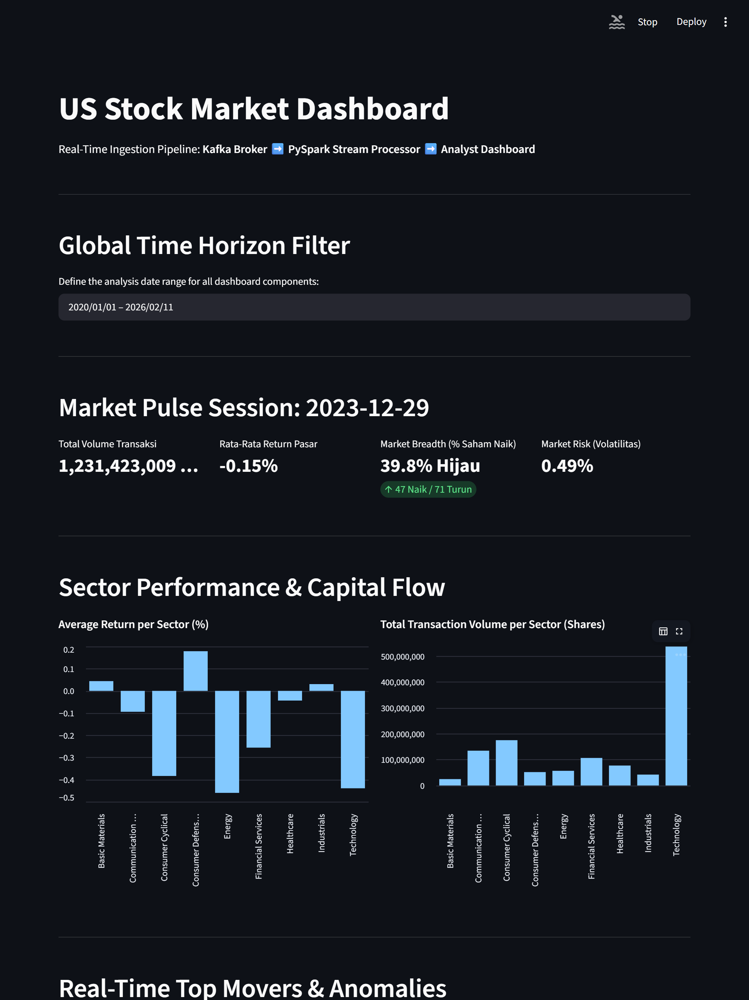
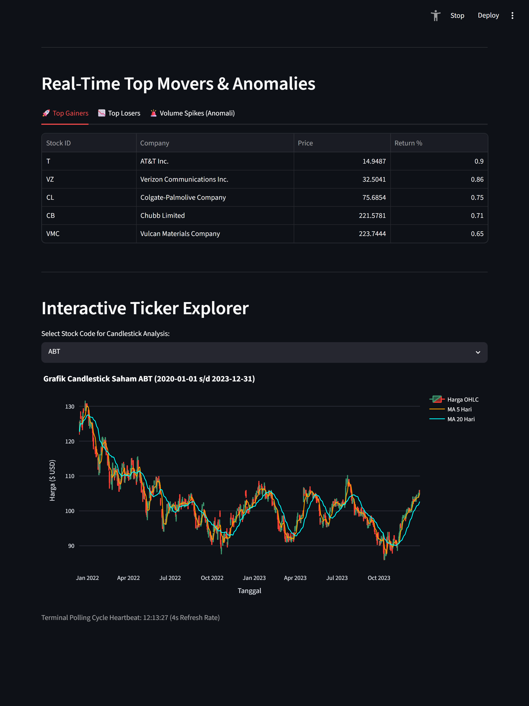

# BDP_ALP — US Stock Market Historical OHLCV Analytics Pipeline

## Big Data Processing Final Project

## Final Dataset

This project uses the following final dataset:

**US Stock Market Historical OHLCV**
Source: Kaggle
Dataset file: `stock_prices_daily.csv`

### Dataset Validation Result

| Item                          |       Result |
| ----------------------------- | -----------: |
| Raw CSV size                  |     33.03 MB |
| Minimum required dataset size |        10 MB |
| Size requirement status       |       Passed |
| Total records                 | 184,138 rows |
| Original number of columns    |           11 |

### Original Dataset Columns

```text
date
ticker
company_name
sector
industry
open
high
low
close
adj_close
volume
```

The original Kaggle dataset uses the column `company_name`. For consistency with the project design, this column is normalized into `company` during preprocessing.

### Dataset Description

The dataset contains historical daily OHLCV (Open, High, Low, Close, Volume) stock market records from major publicly traded companies in the United States.

Several key fields are heavily used throughout the analytics pipeline:

| Column   | Description                                                 |
| -------- | ----------------------------------------------------------- |
| `ticker` | Unique stock symbol used to identify each company           |
| `sector` | Company business sector used for aggregation and comparison |
| `open`   | Stock opening price for a trading day                       |
| `close`  | Stock closing price for a trading day                       |
| `high`   | Highest trading price during the day                        |
| `low`    | Lowest trading price during the day                         |
| `volume` | Total traded shares during the day                          |

The pipeline also generates additional derived metrics for analytics purposes:

| Derived Column     | Description                                         |
| ------------------ | --------------------------------------------------- |
| `daily_return_pct` | Percentage change between opening and closing price |
| `price_range`      | Difference between highest and lowest daily price   |

### Normalized Sample Data Columns

```text
date
ticker
company
sector
industry
open
high
low
close
adj_close
volume
daily_return_pct
price_range
```

A normalized sample containing 1,000 rows is included in:

```text
data/sample/sample_stock_data.csv
```

The full raw dataset is not stored in GitHub. It can be downloaded using:

```bash
./scripts/download_dataset.sh
```

---

## Architecture Diagram

```text
                           +----------------------+
                           | Kaggle CSV Dataset   |
                           | stock_prices_daily   |
                           +----------+-----------+
                                      |
                                      v
                        +---------------------------+
                        | Docker Volume / Local CSV |
                        +-------------+-------------+
                                      |
                                      v
                     +--------------------------------+
                     | Hadoop HDFS (NameNode/DataNode)|
                     | hdfs://namenode:9000/data/... |
                     +---------------+----------------+
                                     |
                    +----------------+----------------+
                    |                                 |
                    v                                 v

       +--------------------------+     +--------------------------+
       | Spark Batch Processing   |     | Kafka Producer Simulator |
       | batch_analysis.py        |     | producer.py              |
       +-------------+------------+     +-------------+------------+
                     |                                |
                     v                                v
          +---------------------+         +----------------------+
          | Batch Analytics     |         | Apache Kafka         |
          | Sector Aggregation  |         | stock-events topic   |
          +---------------------+         +-----------+----------+
                                                      |
                                                      v
                                   +----------------------------------+
                                   | Spark Structured Streaming       |
                                   | streaming_job.py                 |
                                   +----------------+-----------------+
                                                    |
                                                    v
                                   +----------------------------------+
                                   | Streamlit Dashboard              |
                                   | Real-Time Visualization          |
                                   +----------------------------------+
```

---

## Domain

Finance / Stock Market Analytics

## Project Description

This project builds an end-to-end big data pipeline for analyzing historical United States stock market data. Historical OHLCV records are processed through distributed batch analytics using Apache Spark and Hadoop HDFS, while the same records are replayed sequentially to simulate incoming stock market events for streaming analysis using Apache Kafka and Spark Structured Streaming.

The project demonstrates the integration of modern big data technologies for scalable data ingestion, distributed storage, batch processing, real-time streaming analytics, and interactive dashboard visualization.

## Problem Statement

How can a big data pipeline analyze historical stock performance by company and sector while also monitoring simulated stock market activity in real time?

## Planned Batch Insights

1. Identify the sector with the highest average trading volume.
2. Identify companies with the highest average daily return.
3. Identify companies with the highest volatility based on daily return variation.

## Planned Real-Time Metrics

1. Market Pulse Matrix: Real-time calculation of global daily returns, historical volatility (Market Risk via Sample Standard Deviation), and Market Breadth (% of advancing vs. declining stocks).
2. Sector Performance & Capital Flow: Visual tracking of sector rotation to monitor where institutional capital ("whales") is flowing dynamically.
3. Anomaly & Volume Spike Detection: Instant identification of stocks experiencing trading volumes significantly higher than their historical average baseline:
   $$\text{Volume Spike Ratio} = \frac{V_{\text{today}}}{\bar{V}_{\text{hist}}}$$
4. Interactive Ticker Explorer: Deep-dive workbench visualizing anti-zoom Plotly Candlestick profiles integrated with 5-day and 20-day Moving Averages (MA) for trend discovery.

## Technology Stack

* Docker Compose
* Apache Hadoop HDFS
* Apache Kafka
* Apache Spark
* Spark Structured Streaming
* Streamlit
* Python

## Pipeline Architecture

```text
Kaggle CSV Dataset
        |
        v
Hadoop HDFS Storage
        |
        +----> Spark Batch Processing ----> Batch Analytics Output
        |
        +----> Python Kafka Producer ----> Apache Kafka
                                                 |
                                                 v
                                  Spark Structured Streaming
                                                 |
                                                 v
                                      Streamlit Dashboard
```

---

# Dataset Download

Install dependencies:

```bash
python3 -m venv .venv
source .venv/bin/activate
pip install kaggle pandas
```

Login to Kaggle:

```bash
kaggle auth login
```

Download the final dataset:

```bash
chmod +x scripts/download_dataset.sh
./scripts/download_dataset.sh
```

The downloaded raw CSV file will be stored locally in:

```text
data/raw/stock_prices_daily.csv
```

The raw CSV file is ignored by Git and is not uploaded to this public repository.

---

# How to Run

## 1. Clone the Repository

```bash
git clone https://github.com/CatherineElina/BDP_ALP.git
cd BDP_ALP
```

---

## 2. Start Docker Services

Run all services using Docker Compose:

```bash
docker compose up
```

This will start:

* Hadoop NameNode
* Hadoop DataNode
* Apache Kafka
* Spark Master
* Spark Worker
* Streamlit Dashboard

---

## 3. Upload Dataset to HDFS

### Create HDFS directory

```bash
docker exec -it bdp-alp-namenode hdfs dfs -mkdir -p /data/stock
```

### Copy dataset into NameNode container

```bash
docker cp data/raw/stock_prices_daily.csv bdp-alp-namenode:/tmp/stock_prices_daily.csv
```

### Upload dataset from container into HDFS

```bash
docker exec -it bdp-alp-namenode hdfs dfs -put /tmp/stock_prices_daily.csv /data/stock/
```

### Verify dataset in HDFS

```bash
docker exec -it bdp-alp-namenode hdfs dfs -ls /data/stock/
```

Expected output:

```text
Found 1 items
-rw-r--r--   1 root supergroup ... /data/stock/stock_prices_daily.csv
```

---

## 4. Run Spark Batch Analysis

Open a new terminal:

```bash
docker exec -it bdp-alp-spark-master /opt/spark/bin/spark-submit /opt/spark/jobs/batch_analysis.py
```

The batch analysis job reads the dataset directly from Hadoop HDFS:

```python
hdfs://namenode:9000/data/stock/stock_prices_daily.csv
```

---

## 5. Run Kafka Producer

Open another terminal:

```bash
python producer/producer.py
```

Example producer output:

```text
Sent: AAPL @ 192.45
Sent: MSFT @ 415.22
Sent: NVDA @ 120.31
```

The producer simulates live stock market events by replaying historical OHLCV records into the Kafka topic `stock-events`.

---

## 6. Run Spark Structured Streaming

Open another terminal:

```bash
docker exec -it bdp-alp-spark-master /opt/spark/bin/spark-submit --packages org.apache.spark:spark-sql-kafka-0-10_2.13:4.0.0 /opt/spark/jobs/streaming_job.py
```

Example Spark output:

```text
[Batch 1] Successfully appended 752 engineered records to historical log
[Batch 2] Successfully appended 183 engineered records to historical log
[Batch 3] Successfully appended 564 engineered records to historical log
```

This streaming job consumes Kafka events and continuously aggregates stock market data by sector.

---

## 7. Open the Dashboards

| Service             | URL                   |
| ------------------- | --------------------- |
| Hadoop NameNode UI  | http://localhost:9870 |
| Kafka UI            | http://localhost:8080 |
| Spark Master UI     | http://localhost:8082 |
| Streamlit Dashboard | http://localhost:8501 |

The Streamlit dashboard will automatically update as streaming data is processed.

---

# Expected Output

## Spark Batch Analytics Output

The Spark batch analytics job processes historical stock market data stored inside Hadoop HDFS and prints aggregation results directly to the console.

The output includes:

* Average trading volume by sector
* Top companies by average daily return
* Most volatile stocks

```text
=== Average Closing Price by Sector ===
+--------------------+---------+
|              Sector|avg_close|
+--------------------+---------+
|          Healthcare|   247.28|
|  Financial Services|   197.98|
|         Industrials|   194.14|
|          Technology|   177.51|
|   Consumer Cyclical|   177.08|
|  Consumer Defensive|   163.57|
|     Basic Materials|   153.75|
|Communication Ser...|   110.05|
|              Energy|    77.97|
+--------------------+---------+


=== Top 5 Most Volatile Stocks ===
+------+--------------------+--------------------+------------+
|Ticker|        Company_Name|              Sector|price_stddev|
+------+--------------------+--------------------+------------+
|   LLY|Eli Lilly and Com...|          Healthcare|       288.8|
|  COST|Costco Wholesale ...|  Consumer Defensive|      240.16|
|   BLK|     BlackRock, Inc.|  Financial Services|      191.29|
|  META|Meta Platforms, Inc.|Communication Ser...|      183.22|
|    GS|The Goldman Sachs...|  Financial Services|      181.65|
+------+--------------------+--------------------+------------+


=== Average Daily Volume by Sector ===
+--------------------+-----------+
|              Sector| avg_volume|
+--------------------+-----------+
|          Technology|4.5870624E7|
|Communication Ser...|3.0883702E7|
|   Consumer Cyclical|2.7396078E7|
|              Energy|  9726925.0|
|  Financial Services|  8848670.0|
|  Consumer Defensive|  7819863.0|
|          Healthcare|  6171474.0|
|     Basic Materials|  5080293.0|
|         Industrials|  4141391.0|
+--------------------+-----------+


=== Top 5 Companies by Average Daily Return ===
+------+--------------------+--------------+
|Ticker|        Company_Name|avg_return_pct|
+------+--------------------+--------------+
|  AAPL|          Apple Inc.|          0.11|
|  CARR|Carrier Global Co...|           0.1|
|  NVDA|  NVIDIA Corporation|           0.1|
|    GS|The Goldman Sachs...|          0.08|
|   NEM| Newmont Corporation|          0.08|
+------+--------------------+--------------+
```
---

## Streamlit Dashboard

The Consolidated Analytics UI Console utilizes a Top-Down (Macro-to-Micro) Financial Framework packed into a highly intuitive single-page execution layout:

- Section 1 (Global Controller): Features a unified Date Range filter at the very top, acting as a global time-horizon selector for the entire environment.
- Section 2 (Market Pulse): Displays high-level macro variables (Total Volume, Average Return, Volatility, and Advance-Decline Breadth Indicators).
- Section 3 & 4 (Sector Rotation & Top Movers): Visualizes sector-level capital flows via dual bar charts and isolates extreme asset candidates (Top Gainers, Top Losers, and Volume Anomaly Spikes).
- Section 5 (Micro Deep-Dive Analysis): An interactive technical analysis workbench rendering responsive **Plotly Candlestick (OHLC)** layers. Axis coordinates are locked using the parameter `fixedrange=True` to guarantee a completely static layout protected against accidental scroll or swipe zoom actions on iPad and tablet devices.
  




---

# Findings & Conclusion

## Batch Analytics Findings

The Spark batch analysis successfully processed 184,138 historical US stock market records stored in Hadoop HDFS and generated several important insights across sectors and companies.

The analysis showed that the Technology sector produced the highest average trading volume, reaching approximately 45.9 million shares, followed by Communication Services and Consumer Cyclical sectors. This indicates that technology-related companies consistently dominate trading activity in the historical dataset.

In terms of average closing price, the Healthcare sector recorded the highest average stock closing price at approximately 247.28, followed by Financial Services and Industrials. This suggests that companies within these sectors generally maintained higher stock price valuations during the observed historical period.

The volatility analysis identified several companies with highly fluctuating stock prices. Eli Lilly and Company (LLY) showed the highest price volatility, followed by Costco Wholesale (COST), BlackRock (BLK), Meta Platforms (META), and Goldman Sachs (GS). High volatility indicates stronger stock price fluctuations and potentially higher market risk.

The average daily return analysis showed that Apple (AAPL), Carrier Global Corporation (CARR), and NVIDIA (NVDA) achieved some of the strongest average positive daily returns among the analyzed companies.

These batch analytics findings directly address the project problem statement by demonstrating how distributed big data processing can analyze historical stock performance across companies and sectors using Apache Spark and Hadoop HDFS.

---

## Streaming Analytics Findings

The streaming pipeline successfully simulated real-time stock market activity by replaying historical OHLCV records through Apache Kafka.

Spark Structured Streaming continuously consumed Kafka events and aggregated stock market metrics by sector using micro-batch processing and sliding time windows.

The Streamlit dashboard successfully visualized:

* Average closing price by sector
* Event counts within streaming windows
* Historical sector trends
* Continuously updating live charts

During the simulation, the dashboard demonstrated that certain sectors repeatedly generated higher event frequency and higher average closing prices over time.

The integration between Kafka, Spark Structured Streaming, Docker Compose, Streamlit, and Hadoop HDFS successfully enabled near real-time analytics and distributed batch processing within a unified big data architecture.

These streaming analytics results directly support the second part of the problem statement by demonstrating how real-time stock market activity can be monitored continuously using streaming technologies.

---

## Conclusion

This project successfully implemented an end-to-end big data analytics pipeline using Apache Hadoop HDFS, Apache Kafka, Apache Spark, Spark Structured Streaming, Docker Compose, and Streamlit.

The system supports both distributed batch analytics and real-time streaming analytics workflows while processing historical US stock market OHLCV data.

The project successfully answered the main problem statement by demonstrating:

* How historical stock market data can be processed using distributed batch analytics
* How simulated stock market events can be monitored in near real time
* How batch and streaming pipelines can be integrated within one scalable architecture

The final pipeline successfully achieved the main project objectives:

* Distributed data storage using Hadoop HDFS
* Historical stock market batch analysis
* Real-time event streaming simulation
* Streaming aggregation using Spark Structured Streaming
* Interactive live dashboard visualization
* Reproducible deployment using Docker Compose

---

# Known Limitations

* The system uses historical CSV data replay instead of a live stock market API.
* Streaming throughput and scalability were not benchmarked under high-load production conditions.
* The dashboard currently focuses on sector-level aggregation and does not include advanced forecasting or machine learning models.
* Fault tolerance and multi-node distributed deployment were not fully implemented.
* The Kafka producer replays historical records sequentially and does not simulate actual market timing or irregular trading activity.
* The Hadoop HDFS cluster currently uses a single-node replication configuration (`dfs.replication=1`) intended for development and educational purposes rather than production-scale distributed storage.
