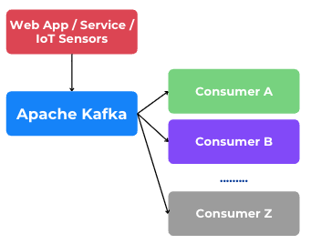
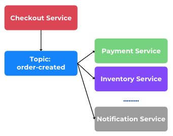
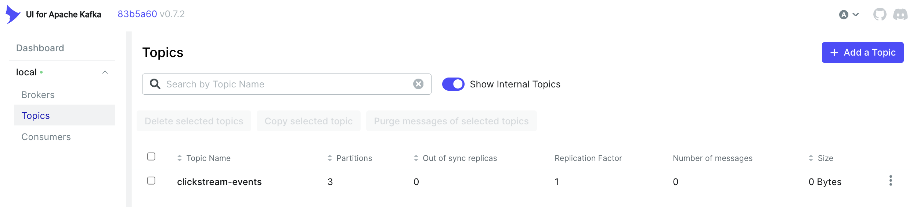
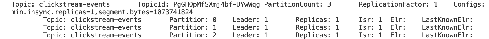
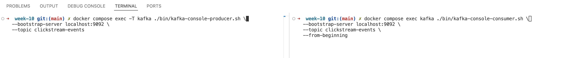
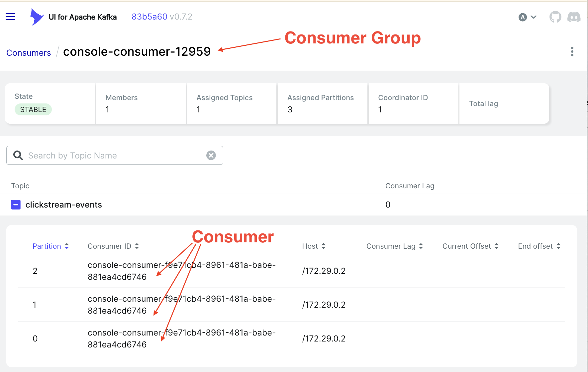
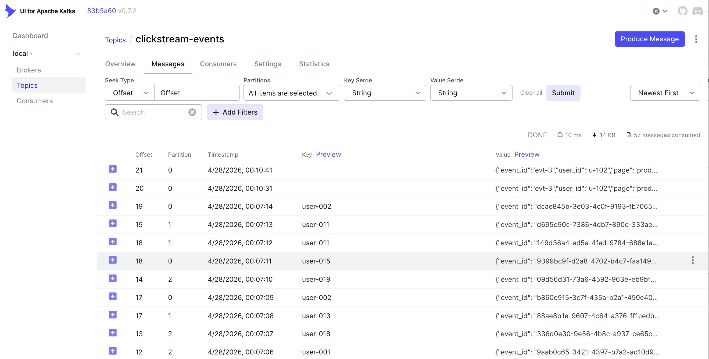

# Week 10: Kafka for Beginners

This week moves from the general idea of streaming systems into hands-on Kafka usage. you will learn what Kafka is, why message brokers are useful in distributed systems, how to run a small local Kafka lab with Docker, and how to build a simple producer-consumer pipeline using Python and Spark Structured Streaming.

The material is intentionally beginner-friendly. The goal is not to cover every Kafka feature, but to make you comfortable with the core building blocks they will see in real data engineering systems.

## Learning Objectives

- explain what Apache Kafka is and where it fits in a data architecture
- explain why message brokers are needed in distributed systems
- distinguish producers, brokers, topics, partitions, offsets, and consumers
- run a single-broker Kafka lab locally with Docker
- inspect topics and messages from a Kafka UI dashboard
- perform basic topic and message operations with Kafka CLI tools
- write a simple Python producer for clickstream events
- write a simple streaming consumer for Kafka data
- explain the difference between `append`, `update`, and `complete` output modes in Spark Structured Streaming

## 1. Kafka Introduction

Apache Kafka is a distributed event streaming platform. In simple terms, Kafka is a system that receives messages from applications, stores them durably for some period of time, and allows one or more consumers to read those messages.

Kafka is often used when data arrives continuously instead of once per day. Examples:

- website clickstream events
- payment transaction logs
- order status updates
- IoT sensor data
- application monitoring logs
- chat or notification events

Kafka terminology for beginners:

- `producer`: the application that sends data into Kafka
- `broker`: a Kafka server that stores and serves messages
- `topic`: a named stream of messages, such as `clickstream-events`
- `partition`: a subdivision of a topic used for scale and ordering
- `offset`: the position of a message inside a partition
- `consumer`: the application that reads data from Kafka
- `consumer group`: a set of consumers that share the work of reading a topic

Think of Kafka as a central event hub:



One producer can send to many consumers, and consumers do not have to run at the same time as the producer. This decoupling is one of Kafka's main strengths.

## 2. Why We Need a Message Broker

In a very small system, one application can call another application directly using HTTP or gRPC. This is simple, but it becomes harder to manage as the system grows.

### A. Microservices Communication

Imagine an e-commerce system:

- `checkout-service`
- `payment-service`
- `inventory-service`
- `notification-service`
- `analytics-service`

If `checkout-service` must call every other service directly, then:

- the sender must know every receiver
- failures in one service can affect the sender
- retries become difficult to manage
- the system becomes tightly coupled

With a message broker, the checkout service can publish one event such as `order-created`. Other services consume it independently.




This makes the system easier to scale and maintain.

### B. Reliability When the Network Is Unstable

Suppose Service A sends data directly to Service B using HTTP:

- if Service B is temporarily down, the request fails
- if the network is unstable, the sender may need retries
- if retries are badly implemented, data can be lost or duplicated

With Kafka, Service A publishes the message to the broker first. Service B can consume later when it is ready again. Kafka acts as a buffer between services.

### C. Handling Traffic Spikes

Some systems generate events unevenly. For example:

- normal traffic: 100 events per second
- flash sale: 20,000 events per second

If every consumer must process data immediately at the same rate as the producer, systems can fail during spikes. Kafka helps absorb bursts because messages stay in the topic and consumers can catch up.

### D. One Event, Many Uses

A single event can be useful for multiple teams:

- operations team wants logs
- analytics team wants metrics
- product team wants clickstream analysis
- fraud team wants anomaly detection

Without a broker, the producer might need to send the same data to many systems. With Kafka, publish once and let many consumers subscribe.

## 3. Local Installation: 1 Kafka Broker in Docker with Strimzi and Kafka UI

Important teaching note:

- Strimzi is best known for managing Kafka on Kubernetes
- for this local classroom lab, we use a Strimzi Kafka container image to run a single broker on Docker
- this is good for learning, but it is not a production-grade cluster

### Lab Topology

This folder includes:

- [docker-compose.yml](./docker-compose.yml)
- [demo/producer_clickstream.py](./demo/producer_clickstream.py)
- [demo/requirements.txt](./demo/requirements.txt)

Services in the lab:

- `kafka`: one broker using the Strimzi Kafka image
- `kafka-ui`: web dashboard to inspect topics, partitions, and messages
- `strimzi-bridge`: optional REST bridge so you can see that Kafka can also be accessed through HTTP-based clients

### Start the Lab

Navigate to:

```bash
cd module-2/week-10
```

Start the services:

```bash
docker compose up
```

Check status:

```bash
docker compose ps
```

### Access the Dashboard

Open:

```text
http://localhost:8080
```

In Kafka UI, you can:

- see available brokers
- create topics
- inspect partitions
- browse messages inside a topic
- inspect consumer groups

### Access the Strimzi Kafka Bridge

Open:

```text
http://localhost:8081
```

The bridge is useful to explain that some clients can interact with Kafka through HTTP instead of the native Kafka protocol. This is not the main interface for serious streaming applications, but it is useful for demonstrations and integration discussion.

## 4. Basic Operations with Kafka

Below are the most important beginner operations. Run them from `module-2/week-10`.

### Create a Topic

Run this command in terminal `module-2/week-10`:

```bash
docker compose exec kafka ./bin/kafka-topics.sh \
  --bootstrap-server localhost:9092 \
  --create \
  --topic clickstream-events \
  --partitions 3 \
  --replication-factor 1
```

Go to http://localhost:8080/ui/clusters/local/all-topics. Make sure your result: 




Otherwise, you can see list of topics via terminal: 

```bash
docker compose exec kafka ./bin/kafka-topics.sh \
  --bootstrap-server localhost:9092 \
  --list
```

### Describe a Topic

```bash
docker compose exec kafka ./bin/kafka-topics.sh \
  --bootstrap-server localhost:9092 \
  --describe \
  --topic clickstream-events

```

Result: 



Here’s a cleaner and more structured version:

---

### Produce and Consume Messages Manually

#### 1. Start a Producer

Run the following command to start producing messages to the `clickstream-events` topic:

```bash
docker compose exec -T kafka ./bin/kafka-console-producer.sh \
  --bootstrap-server localhost:9092 \
  --topic clickstream-events
```

Each line you enter in the terminal represents **one message**.

Example:

```json
{"event_id":"evt-3","user_id":"u-102","page":"product/sku-77","event_type":"page_view","event_time":"2026-04-26T09:01:12"}
```

---

#### 2. Start a Consumer (in a Separate Terminal)

Open a new terminal (split mode) 




Next, execute this command in the right terminal:

```bash
docker compose exec kafka ./bin/kafka-console-consumer.sh \
  --bootstrap-server localhost:9092 \
  --topic clickstream-events \
  --from-beginning
```

This will continuously listen to the topic and display incoming messages in real time.

**Additional Observation (Kafka UI)**

* Open the browser and access Kafka UI
* Navigate to **Consumer**
* You will see a list of consumer groups along with their associated consumers and activity status




---

#### 3. Send More Messages

Go back to the **producer terminal** and input additional messages **one by one** then push **Enter**:

```json
{"event_id":"evt-4","user_id":"u-102","page":"product/sku-77","event_type":"add_to_cart","event_time":"2026-04-26T09:01:45"}
{"event_id":"evt-5","user_id":"u-103","page":"search?q=shoes","event_type":"search","event_time":"2026-04-26T09:02:10"}
{"event_id":"evt-6","user_id":"u-104","page":"home","event_type":"page_view","event_time":"2026-04-26T09:02:55"}
{"event_id":"evt-7","user_id":"u-104","page":"category/sneakers","event_type":"page_view","event_time":"2026-04-26T09:03:20"}
{"event_id":"evt-8","user_id":"u-104","page":"product/sku-88","event_type":"page_view","event_time":"2026-04-26T09:03:50"}
{"event_id":"evt-9","user_id":"u-104","page":"product/sku-88","event_type":"add_to_cart","event_time":"2026-04-26T09:04:10"}
{"event_id":"evt-10","user_id":"u-105","page":"checkout","event_type":"checkout_start","event_time":"2026-04-26T09:04:40"}
{"event_id":"evt-11","user_id":"u-105","page":"payment","event_type":"payment_attempt","event_time":"2026-04-26T09:05:05"}
{"event_id":"evt-12","user_id":"u-105","page":"payment","event_type":"payment_success","event_time":"2026-04-26T09:05:30"}
{"event_id":"evt-13","user_id":"u-106","page":"product/sku-55","event_type":"page_view","event_time":"2026-04-26T09:06:12"}
{"event_id":"evt-14","user_id":"u-106","page":"product/sku-55","event_type":"add_to_cart","event_time":"2026-04-26T09:06:45"}
{"event_id":"evt-15","user_id":"u-106","page":"cart","event_type":"remove_from_cart","event_time":"2026-04-26T09:07:10"}
{"event_id":"evt-16","user_id":"u-107","page":"home","event_type":"page_view","event_time":"2026-04-26T09:08:00"}
{"event_id":"evt-17","user_id":"u-107","page":"search?q=bag","event_type":"search","event_time":"2026-04-26T09:08:25"}
{"event_id":"evt-18","user_id":"u-107","page":"product/sku-99","event_type":"page_view","event_time":"2026-04-26T09:08:50"}
```

---

#### 4. Observe the Result

As you send messages from the producer, you will see them appear **in real-time** in the consumer terminal.

This demonstrates how Kafka streams data between producers and consumers.


### Delete a Topic

```bash
docker compose exec kafka ./bin/kafka-topics.sh \
  --bootstrap-server localhost:9092 \
  --delete \
  --topic clickstream-events
```

Congrats! You've already learned basic commands in Kafka:

1. create a topic
2. describe a topic
3. publish and consume messages manually
4. delete a topic

## 5. Simple Python Producer: Clickstream Events

The file [demo/producer_clickstream.py](./demo/producer_clickstream.py) simulates website clickstream logs.

Each generated event contains:

- `event_id`
- `user_id`
- `session_id`
- `page`
- `event_type`
- `device_type`
- `source`
- `event_time`

This is a realistic beginner use case because clickstream data is easy to understand and naturally event-based.

### Install Python Dependencies

In a new terminal, run this command: 

```bash
cd module-2/week-10/demo
pip install -r requirements.txt
```

### Run the Producer

```bash
python producer_clickstream.py
```

Optional environment variables:

```bash
export KAFKA_BOOTSTRAP_SERVERS=localhost:29092
export KAFKA_TOPIC=clickstream-events
export MESSAGE_INTERVAL_SECONDS=1
```

What you should observe:

- messages appear continuously in Kafka UI



- events arrive in near real time
- one producer can keep sending even if consumers start later


## Summary

Kafka is important because modern systems generate events continuously, not only in daily batches. A message broker helps services communicate more reliably, absorb traffic spikes, and decouple producers from consumers.

For this week, you should leave class with three strong ideas:

- Kafka is the event backbone between producers and consumers
- message brokers improve reliability and decoupling in distributed systems
- streaming systems are not only about moving messages, but also about continuously computing results from incoming events
